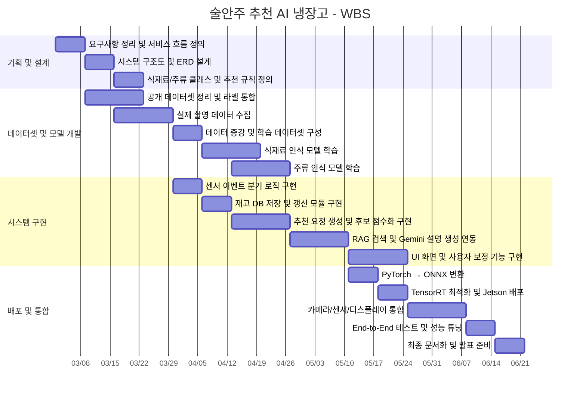

# 🍻 술안주 추천 AI 냉장고

주류와 냉장고 내 식재료를 함께 인식하여, 현재 보유 재료에 맞는 안주 후보와 레시피를 추천하는 스마트 냉장고 프로젝트입니다.
<p align="center">
  
  
  
  
  
</p>

---

## 📖 About

본 프로젝트는 기존 AI 냉장고의 범용 식재료 관리 중심 구조를 넘어,  
**주류 인식 + 식재료 재고 관리 + 안주 추천**을 하나의 흐름으로 통합한 저비용 임베디드 프로토타입을 목표로 합니다.

사용자는 냉장고 내 재고를 자동으로 관리할 수 있고,  
외부에서 인식된 주류와 현재 보유 식재료를 기반으로  
가장 적합한 안주 후보와 조리 정보를 추천받을 수 있습니다.

핵심은 단순 레시피 검색이 아니라,  
**실제 냉장고 사용 상황에서 곧바로 활용 가능한 추천 시스템**을 구현하는 데 있습니다.

---

## 🚀 Project Goal

- 주류 및 보유 식재료 기반 맞춤형 안주 레시피 추천 AI 냉장고 프로토타입 개발
- CNN 기반 식재료 및 주류 인식 모델 구축
- 센서 기반 이벤트 처리 파이프라인 설계
- RAG 및 LLM 기반 추천·설명 생성 기능 구현
- Jetson Orin Nano 환경에서 실시간 추론 가능한 임베디드 시스템 구현

---

## ✨ Key Features

### 1. 식재료 인식 및 재고 관리
- 냉장고 상단 카메라를 통해 식재료 반입·반출 자동 인식
- 인식 결과를 DB에 저장하고 수량 상태 갱신
- 현재 냉장고 재고 목록 시각화
- 인식 오류 발생 시 사용자 수정 및 삭제 지원

### 2. 주류 인식
- 카메라를 통해 주류를 카테고리 단위로 분류
- 소주, 맥주, 화이트와인, 레드와인, 위스키, 샴페인, 사케 등 인식
- 인식된 주류 정보를 추천 입력으로 연계

### 3. 센서 기반 이벤트 처리
- 문 열림 센서와 움직임 감지 센서를 함께 사용
- 문열림 + 움직임: 식재료 인식 모드 실행
- 움직임만 감지: 주류 인식 모드 실행
- 이벤트에 따라 인식 경로를 자동 분기

### 4. 안주 추천 시스템
- 현재 식재료 + 주류 정보를 기반으로 추천 요청 생성
- 저장된 후보/레시피/페어링 규칙 우선 조회
- 식재료 보유 여부, 주류 적합도, 부족 재료 수를 기준으로 후보 점수화
- 상위 3개 안주 후보 추천
- 후보가 부족한 경우 Gemini API 기반 설명·추천 보조 생성

### 5. 사용자 출력 및 인터페이스
- 추천 후보 3개 제공
- 추천 이유 및 부족 재료 안내
- 선택한 안주의 조리 순서와 상세 레시피 확인
- 현재 재고 화면, 추천 결과 화면, 보정 화면 간 자연스러운 UI 흐름 제공

---

## 💡 Differentiation

기존 상용 AI 냉장고가 식재료 인식과 일반 레시피 추천 중심이라면,  
본 프로젝트는 다음 요소를 하나의 시스템으로 통합합니다.

- 식재료 인식
- 주류 카테고리 인식
- 냉장고 사용 이벤트 기반 상태 관리
- 안주 추천
- 추천 이유 설명

또한 생성형 AI를 임의 추천 도구가 아니라,  
**지식 기반 검색과 규칙 기반 추천 결과를 사용자 친화적으로 설명하는 보조 계층**으로 사용한다는 점에서 차별화됩니다.

---

## 🏗️ System Architecture

```text
[Hardware Input]
- Door Open Sensor
- Motion Sensor
- USB Camera

        ↓

[Event & Recognition Layer]
- Event Detection Module
- Recognition Mode Routing
- Ingredient Recognition Module (MobileNet)
- Alcohol Recognition Module (MobileNet)
- User Correction Processing

        ↓

[Inventory & Recommendation Layer]
- Inventory State Management
- Recommendation Request Generation
- Cache Lookup
- RAG Search
- Recommendation Generation
- Missing Ingredient Calculation
- Recommendation Reason Generation

        ↓

[DB & External Services]
- Inventory DB
- Recipe DB
- Pairing Rule DB
- Recommendation History
- Recommendation Cache
- Gemini API

        ↓

[User Output]
- Current Inventory Visualization
- Top 3 Recommendation Display
- Missing Ingredient Guide
- Recommendation Reason Guide
- Recipe Detail Display
```

## 🔄 Data & Recommendation Flow

### 이벤트 분기
1. 시스템은 센서 입력을 지속적으로 수신합니다.
2. 먼저 움직임 감지 여부를 확인합니다.
3. 움직임이 없으면 별도 처리 없이 다시 대기합니다.
4. 움직임이 감지되면 문 열림 감지 여부를 추가로 확인합니다.
5. 문 열림이 감지되면 식재료 인식 모드로 전환합니다.
6. 문 열림 없이 움직임만 감지되면 주류 인식 모드로 전환합니다.

### 식재료 인식 및 재고 갱신
1. 카메라 촬영을 수행합니다.
2. 촬영된 이미지를 기반으로 식재료를 인식합니다.
3. 인식 결과의 신뢰도를 확인합니다.
4. 신뢰도가 충분하지 않으면 사용자 보정을 요청합니다.
5. 최종 확정된 식재료 정보를 재고 상태 관리 단계로 전달합니다.
6. 재고 DB를 갱신하고 현재 재고 시각화 화면에 반영합니다.

### 주류 인식 및 추천 요청 생성
1. 움직임 감지가 발생하면 주류 인식 모드를 시작합니다.
2. 카메라 촬영 후 주류 카테고리를 인식합니다.
3. 인식 결과의 신뢰도를 확인합니다.
4. 신뢰도가 낮으면 사용자 보정을 반영합니다.
5. 확정된 주류 정보는 현재 재고 DB 조회 단계로 전달됩니다.
6. 저장된 식재료 정보와 결합하여 추천 요청을 생성합니다.

### 추천 생성
1. 현재 식재료와 주류 조합에 대한 추천 결과 또는 후보 정보가 DB에 존재하는지 확인합니다.
2. 기존 후보가 있으면 식재료 보유 여부, 주류 적합도, 부족 재료 수를 기준으로 필터링 및 점수화를 수행합니다.
3. 상위 3개의 안주 후보를 최종 추천 결과로 구성합니다.
4. 적절한 후보가 없거나 정보가 부족하면 레시피 DB와 페어링 규칙 DB를 기반으로 새로운 후보를 조회합니다.
5. 필요 시 Gemini API를 활용해 추천 이유 문장 또는 레시피 설명을 보완 생성합니다.
6. 부족한 재료와 추천 이유를 함께 정리합니다.
7. 추천 후보 3개, 부족 재료 안내, 추천 이유 안내를 사용자에게 제공합니다.
8. 사용자가 특정 후보를 선택하면 해당 안주의 레시피 상세 정보를 추가로 제공합니다.

### 사용자 보정
1. 식재료 또는 주류 인식 결과를 화면에 표시합니다.
2. 사용자가 수정이 필요한지 판단합니다.
3. 수정이 필요하지 않으면 그대로 최종 확정합니다.
4. 수정이 필요하면 사용자가 직접 값을 입력합니다.
5. 시스템은 보정 처리를 수행하고 재고 상태 또는 인식 결과를 갱신합니다.
6. 보정된 결과를 최종 결과로 확정합니다.

---

## 🗄️ Database Design

본 프로젝트의 데이터베이스는 식재료 재고 관리, 레시피 및 페어링 지식 관리, 추천 실행 관리, 사용자 보정 이력 관리 영역으로 구성됩니다.

### Core Tables
- `INGREDIENT_MASTER`: 식재료 기준 정보 관리
- `INVENTORY_ITEM`: 현재 냉장고 재고 상태 저장
- `ALCOHOL_MASTER`: 주류 카테고리 정보 관리
- `RECIPE_MASTER`: 레시피 기본 정보 저장
- `RECIPE_INGREDIENT_MAP`: 레시피와 식재료 간 다대다 관계 정의
- `PAIRING_RULE`: 주류와 레시피 간 페어링 규칙 저장

### Recommendation Tables
- `RECOMMENDATION_REQUEST`: 추천 요청 시점의 입력 컨텍스트 저장
- `RECOMMENDATION_HISTORY`: 실제 생성된 추천 결과 저장
- `RECOMMENDATION_CACHE`: 동일하거나 유사한 입력 조합에 대한 캐시 저장

### User Feedback Table
- `CORRECTION_LOG`: 식재료 또는 주류 인식 결과에 대한 사용자 수정 이력 저장

이 구조를 통해 식재료 기준 정보와 실제 재고 상태를 분리 관리하고,  
주류-레시피 페어링 적합도와 추천 결과 재사용까지 반영할 수 있도록 설계했습니다.

---

## ⚙️ Machine Learning Pipeline

### 학습 파이프라인
- 총 30개 식재료 클래스를 대상으로 식재료 인식 모델을 학습합니다.
- 공개 이미지 데이터셋과 실제 촬영 이미지를 함께 활용합니다.
- 일부 클래스는 실제 촬영 데이터로 보강합니다.
- 수집 데이터는 라벨 정제와 클래스 통합을 거쳐 학습용 통합 데이터셋으로 구성됩니다.
- 데이터 증강을 통해 조명 변화, 반사, 시야 차이, 부분 가림 조건을 반영합니다.
- 최종적으로 학습·검증·테스트 데이터로 분할하여 학습하고, 모델은 PyTorch 형식으로 저장합니다.

### 배포 파이프라인
1. PyTorch 기반으로 학습된 모델을 준비합니다.
2. 모델을 ONNX 형식으로 변환합니다.
3. TensorRT 엔진으로 최적화합니다.
4. 최적화된 모델을 Jetson Orin Nano 환경에 배포합니다.
5. 실시간 카메라 입력을 받아 식재료 또는 주류 인식을 수행합니다.
6. 인식 결과를 재고 갱신 또는 추천 요청 생성 단계에 활용합니다.
7. 최종 결과를 디스플레이 화면에 출력합니다.

---

## 🖥️ UI Overview

본 시스템은 사용자의 실제 사용 흐름에 맞춰 다음 화면으로 구성됩니다.

- **메인 화면**: 시스템 진입 화면
- **현재 재고 화면**: 냉장고에 저장된 식재료 현황 확인
- **추천 결과 화면**: 주류 인식 결과와 현재 식재료를 바탕으로 생성된 추천 후보 확인
- **추천 상세 화면**: 선택한 후보의 상세 정보, 부족 재료, 추천 이유 확인
- **인식 보정 화면**: 인식 결과 수정 및 보정

사용자는 메인 화면에서 현재 재고 화면 또는 추천 결과 화면으로 이동할 수 있으며,  
추천 결과 화면에서는 재추천 요청 또는 인식 보정 화면 이동도 가능합니다.  
추천 상세 화면에서는 부족한 재료와 추천 이유까지 함께 확인할 수 있도록 구성했습니다.

---

## 🛠️ 기술 스택

| 영역 | 기술 (Stack) | 상세 |
|:---:|:---|:---|
| **Edge Device** |  | 임베디드 환경에서 실시간 식재료/주류 인식 및 추천 수행 |
| **Vision Model** |   | 식재료 및 주류 카테고리 인식 모델 |
| **Training** |  | 식재료 인식 모델 학습 |
| **Optimization** |   | Jetson 배포를 위한 모델 변환 및 추론 최적화 |
| **Generative AI** |  | 추천 이유 및 설명 보완 생성 |
| **Recommendation** |   | DB 우선 조회, 후보 필터링/점수화, 추천 보완 생성 |
| **Database** |  | 재고 관리, 레시피/페어링 지식, 추천 이력 및 캐시 저장 |
| **Input / Sensors** |   | 사용자 행동 감지 및 식재료/주류 입력 수집 |
| **Output / UI** |  | 현재 재고, 추천 후보 3개, 부족 재료, 추천 이유, 보정 기능 제공 |
| **Data Source** |   | 공개 데이터셋 + 실제 촬영 데이터 기반 학습 |


---

## 📅 WBS Gantt Chart (2026.03 ~ 2026.06)


---

## 🔑 Keywords

- AI Refrigerator
- Ingredient Recognition
- Alcohol Recognition
- Food Pairing Recommendation
- Recipe Generation
- Jetson Orin Nano
- RAG
- LLM
- Embedded AI
